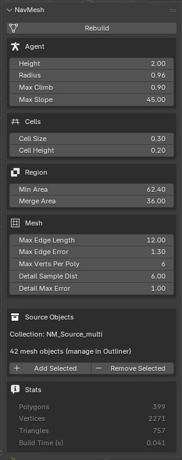

# Recast NavMesh — Blender Add-on

> **Human-Written Notice**: There was this nice recast/navmesh support in the past, I hope you find this useful. It ships with an AGENTS.md. I've used `kilo` as the harness with `deepseek-v4-pro`, and I've installed `@dbalster/blender-plugin` and `@dbalster/gdb-plugin` to allow the AI to debug and also operate blender.

Generate navigation meshes from selected Blender geometry using the [Recast & Detour](https://github.com/recastnavigation/recastnavigation) library.

Renders semi-transparent green helper meshes with a properties panel in the 3D View sidebar, including a one-click **Rebuild** button.

> **AI-Generated Notice**: This entire project was generated by an AI coding assistant ([Kilo](https://kilo.ai)). Every line of code, documentation, build script, CI workflow, and this README was written by AI based on Recast/Detour header analysis and Blender Python API documentation. No human wrote any part of this software.



## Features

- One-click navmesh generation from selected mesh objects **or a stored source collection**
- **Source collection management** — add/remove objects from a named source collection; rebuild uses the collection even when nothing is selected
- Configurable **agent parameters** (height, radius, max climb, max slope)
- Configurable **rasterization** settings (cell size, cell height)
- Configurable **region generation** (min region area, merge threshold area)
- Configurable **mesh generation** (edge length, simplification error, verts per poly, detail sampling)
- Semi-transparent material with wireframe overlay
- Properties panel showing navmesh **stats** (polygon count, vertex count, triangles, build time)
- Works with flat planes, cubes, and complex geometry

## Installation

## Platform Support

> **Linux only.** This add-on has been developed and tested exclusively on Arch Linux with Blender 5.1. macOS and Windows builds are configured in CI but are **completely untested** and likely non-functional. Contributions for other platforms are welcome.

### 1. Install the add-on in Blender

Download the latest `navmesh_addon-*.zip` from [Releases](https://github.com/danielbalster/recastnavmesh-blender-addon/releases).

In Blender: **Edit → Preferences → Add-ons → Install…** → select the `.zip` file → enable "Recast NavMesh".

### 2. Build the native library

The add-on ships with C++ source code but requires compiling the native wrapper library. A Python build script automates this:

```bash
# Navigate to the add-on directory (inside Blender's add-on folder)
cd ~/.config/blender/5.1/extensions/user_default/navmesh_addon/

# Build (clones recastnavigation and compiles the wrapper)
python3 build_libs.py
```

**Prerequisites**: `g++`, `git` (for the initial clone). CMake is **not** required.

### For developers / manual build

```bash
git clone --depth 1 https://github.com/danielbalster/recastnavmesh-blender-addon.git
cd recastnavmesh-blender-addon
python3 build_libs.py        # clones recastnavigation + compiles
python3 package.py           # creates navmesh_addon.zip
```

## Usage

1. Select one or more mesh objects in the 3D View
2. Open the sidebar (**N** key) → **NavMesh** tab
3. Adjust **Agent**, **Cells**, **Region**, and **Mesh** settings as needed
4. Click **Rebuild**
5. A `navmesh_<name>` object appears, linked to a `NM_Source_<name>` collection

### Source Collection Workflow

On first rebuild, a `NM_Source_<name>` collection is created containing the selected source objects. On subsequent rebuilds, you can either:

- **Select new geometry** and click Rebuild — the collection is updated
- **Select nothing** and click Rebuild — the stored source collection is used
- Use **Add Selected** / **Remove Selected** in the panel to manage the collection from the Outliner

The navmesh object is always placed in the **master scene collection**, not inside `NM_Source_*`.

## Build Settings Reference

| Setting | Section | Default | Description |
|---------|---------|---------|-------------|
| Height | Agent | 2.0 m | Min floor-to-ceiling height for walkable areas |
| Radius | Agent | 0.6 m | Erosion radius around obstacles |
| Max Climb | Agent | 0.9 m | Maximum traversable step height |
| Max Slope | Agent | 45° | Maximum walkable slope angle |
| Cell Size | Cells | 0.3 m | XZ-plane rasterization cell size |
| Cell Height | Cells | 0.2 m | Y-axis rasterization cell size |
| Min Area | Region | 5.76 m² | Minimum region size (smaller regions discarded) |
| Merge Area | Region | 36 m² | Regions below this size are merged into larger neighbors |
| Max Edge Length | Mesh | 12 m | Contour edges longer than this are split |
| Max Edge Error | Mesh | 1.3 vx | Maximum contour simplification deviation |
| Max Verts Per Poly | Mesh | 6 | Maximum vertices per navigation polygon |
| Detail Sample Dist | Mesh | 6 m | Detail mesh sample spacing |
| Detail Max Error | Mesh | 1 m | Maximum detail mesh simplification error |

## How It Works

```
Selected Blender meshes (or source collection)
  → Extract world-space vertices + triangles (Y/Z coordinate swap)
  → Recast pipeline: classify → rasterize → filter → compact
    → regions → contours → polymesh → detail
  → Detour: dtCreateNavMeshData → raw tile binary
  → Parse tile binary → extract detail mesh triangles
  → Create Blender mesh object with transparent material
```

The bridge between Python (Blender) and C++ (Recast/Detour) is a C-linkage wrapper (`navmesh_wrapper/wrapper.cpp`) compiled into a shared library loaded via Python's `ctypes`.

## Credits

- **[Recast & Detour](https://github.com/recastnavigation/recastnavigation)** — Navigation mesh generation and query library by Mikko Mononen
- **[Blender](https://www.blender.org/)** — 3D creation suite
- This project is glue code connecting the two

## License

MIT — see [LICENSE](LICENSE)

---

*This entire project (code, docs, CI, build system) was generated by [Kilo](https://kilo.ai), an AI coding assistant. Only tested on Arch Linux with Blender 5.1.*
